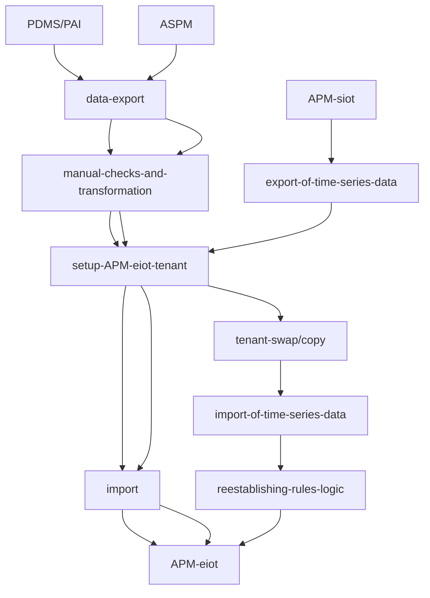
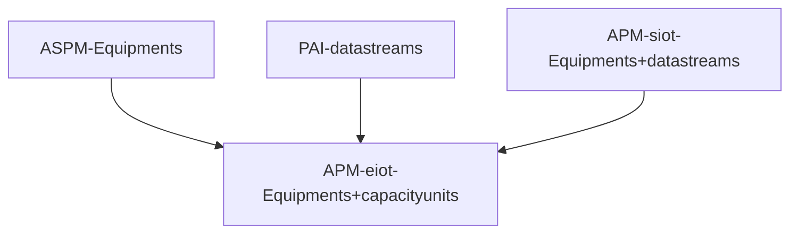

# Introduction
The legacy products SAP IoT, SAP PDMS (Predictive Maintenance and Service), SAP ASPM (Asset Strategy and Performance Management),
SAP PAI (Predictive Asset Insights) or
SAP APM based on SAP IoT (Asset Performance Management) have been sunset by SAP in 2022, 2023 and 2024 respectively so that new customers cannot buy these products anymore.

The alternative to PDMS, PAI and ASPM and the successor to APM based on SAP IoT is APM based on Embedded IoT made generally available in October 2024. The old (base) license for APM was based on the material number 8012342. The new (base) license material number for APM is 801892.

This guide intends to show the way to customers, partners and involved SAP personell how this migration can be done commercially and technically.

# Audience and Contribution
This guide is meant for everyone driving or participating in the migration to APM based on Embedded IoT.

This guide is written and continously updated by the dedicated _APM migration coaches_ that work with those customers, that are productive on the legacy products, to coach them actively in the migration. But it might also be relevant to people that have not yet been fully productive with the legacy products and are looking to switch during the project or that are implementing the new APM architecture and still are aware of the legacy products and how they worked.

At the customer this might be the _Reliability Engineer_ that wants to understand the functional differences and the implications to his data,
the internal (or partner staffed) _IT_ person that wants to understand the necessary technical steps and plan the migration or
the _Buyer_ that wants to understand how entitlements and costs change with the new product.

The partner might be an implementation partner chosen by the customer to support the migration,
a software partner that provides complementary software,
a software partner that provides components of APM
or a reseller that sells APM. To simplify refering to either the in-house customer IT or the personell of the implementation partner of choice we will in the guide always refer to _IT_ simply. To simplify this guide both the reseller account executive or the SAP account executive are referred to only as _Account Executive_.

The SAP personell required in the migration of customers is the _Account Executive_ who needs to negotiate the new license terms and conditions with the customer buyer,
the _Customer Success Partner_ who helps the customer with adopting this and other DSC (Digital Supply Chain) solutions,
the _Product Team Member_ (e.g. a developer or a product manager) helping to understand specific product capabilities or answering a support ticket.

We will use the above roles marked in italic consistently throughout the guide to allow you to find more easily the aspects related to your role.
> [!NOTE]
> Your contribution to this guide is very much appreciated by the SAP APM community so please feel free to create issues or to create pull requests if you want to correct or enhance it.

# Technical & Commercial Migration Scenarios
The below visualisation shows how to migrate data from existing legacy tenants to a target APM eiot tenant (APM eiot is short for APM based on embedded IoT). The technical migration touches the application used in production by APM end users, e.g. _Reliability Engineers_. So it needs to be carefully planned by _IT_ and needs to consider which data needs to be retained and how the switch over happens for each of multiple tenants in place.

As you might have multiple deployments of PAI, ASPM and legacy APM in parallel you might end up with less tenants compared to what you have today. APM combines the features and data model of ASPM and PAI into one. 

APM eiot is onyl offered on Azure. So customers having worked in AWS have to consider setting up additional subaccounts in Azure (eu20, us20) to deploy APM eiot there.

PDMS and PAI are really based on the same technology below. The rest of the guide will only refer to PAI for simplicity.

From a commercial migration point of view the license metrics are harmonized as follows.

One key difference is that in APM eiot the Equipments metric is only measured in the production tenant (assuming that the other tenants have the same or less number of equipments in them). The capacity units (additional usage based metric) are measured across all tenants.

In most cases where customers used both Asset Strategy and Asset Health the price per equipment remains stable. Customers coming from ASPM or PAI used standalone will have to pay more per equipment as APM allows for Asset Strategy features and Asset Health features both to be used on the same equipments.

The minimum number of equipments that SAP will allow in a contract has been doubled when compared to APM siot to reflect the base costs SAP has with each tenant.

For more details please refer to the product supplements of the new APM eiot license: https://assets.cdn.sap.com/agreements/product-use-and-support-terms/cls/en/sap-asset-performance-management-and-sap-asset-performance-management-advanced-capabilities-add-on-supplement-english-v10-2024a.pdf.

_Account Executives_ and _Customer Success Partners_ additionally should refer to the Pricing Guide at https://workzone.one.int.sap/site#workzone-home&/groups/OhWCaHn2WD0dJcCE7NPMEz/workpage_tabs/x7b6HI0YannX29dEGAGK3L.

The following sections address different scenarios and the concrete migration approach for each.

## Migration from PAI and ASPM to APM

The migration from PAI and ASPM is supported with tools provided by the _APM Product Team_ that allow _IT_ together with a _APM migration coach_ to export data from the old tenants and import it into the target APM eiot tenant selectively. Only the following subset of objects is supported:

1. Recommendation
2. Risk and Criticality Assessment
3. Risk and Criticality Assessment Template
4. Failure Mode and Effects Analysis
5. Reliability Centered Maintenance
6. Indicators
7. Alerts
8. Time Series

The first 5 tools (ASPM) are based on internal apis and on flows provided in an SAP internal DI (SAP Data Intelligence) instance so only D- or I- users can apply them. If a partner is engaged in _IT_ he might have a C-user with access to the SAP network which would also allow him to make use of these tools directkly.

The last 3 tools (PAI) have been built on public apis and can be used by anyone. They are provided in the same github repository in which this guide is provided.

For all of the remaining object types or configuration the migration has to happen manually (e.g. configuration, FMEA templates, devices ...) which means that in the new tenant they have to be recreated manually.

All objects replicated from _ERP_ (in the rest of the document this might refer to either ECC or S4 Private Cloud Edition or S4 Publich Cloud Edition) can be replicated again from such backend but the configuration for this replication (e.g. which class types ...) has to be done manually following the APM getting started and the APM integration guides for eiot at https://help.sap.com/docs/SAP_APM. 

None of these migrations is simple as in all cases a new tenant and an old tenant have to exist in parallel. The underyling data model is based in the case of PAI and ASPM on ACF (Asset Central Foundation) and in the case of APM on ERP (the One Domain Model to be precise) so the terminology and the functional possibilities change significantly.

From a commercial migration point of view the APM eiot license has to be in place so you can create APM tenants and the ASPM or PAI license should remain in place, while you still productively use them. So an overlap for the duration of the migration project makes sense.

For a full list of functional differences and features, that might be available only at a later date please refer to chapter Feature Comparison below.

## Migration from APM siot to APM eiot

The migration from APM siot to APM eiot will be supported by a planned feature that allows you to copy an APM tenant in full and then swaping this tenant from siot to eiot. If the copy step is not needed (tenant is already on Azure, scope used requires no post-processing, tenant is not a productive tenant and a shorter or longer downtime is acceptable) then a swap can be requested from SAP once such feature is offered by the _APM product team_.

The copy and the swap will not retain any rules as the rule logic is so fundamentally different that all rules have to be reestablished manually. It will also not retain any time series data - this will have to be exported and imported on the side. Lastly everything that is device management specific (e.g. mqtt endpoints, additionally established trust certificates, gateways, firmware coding, payload structure ...) will basically be not available until device management will be offered again in APM eiot and even then it will be fundamentally different and retention is likely not possible.

In regards of migration scope and effort based on the usage scope the migration can range from something that can be done on the weekend to a multi-month project. Here are a few examples:

1. If only Asset Strategy objects are used and the tenants are already on Azure (eu20, us20) and if the APM eiot license is in place then the swap can be done on the weekend with some smoke testing Monday morning and afterwards business users should be able to use the system again based on the new URLs and the (to be updated) end user documentation.
2. If anything in Asset Strategy is used plus data ingestion via api and the indicator chart then its conceivable to also switch over on a weekend albeit bringing in the historic time series data might take some days to be completed.
3. If complex rules are used or if device management for individual devices is used then there needs to be an implementation phase where the rules are reestablished and the ingestion is reestablished (in the worst case device by device in the field). To facilitate this its likely that the new and the old tenant need to co-exist and new data is maintained in both. If in this case both Asset Strategy and Asset Health have been used then for the interim period the maintenance of Asset Strategy objects has to happen in the new tenant while the condition monitoring has to happen in the old tenant until switch over is possible.

Additional constraints that can create complexity for the migration exists if you extended APM via API or via UI.

For a full list of functional differences and features, that might be available only at a later date in APM eiot please refer to chapter Feature Comparison below.

# Planned Improvements to this Guide

Provide the list of differences and the mitigations for ASPM, PAI and APM as a starting point.