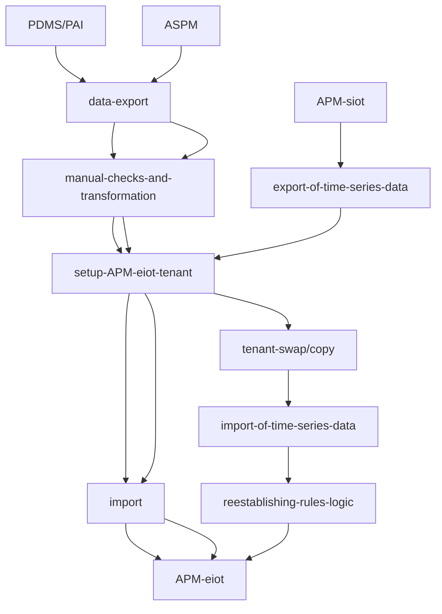
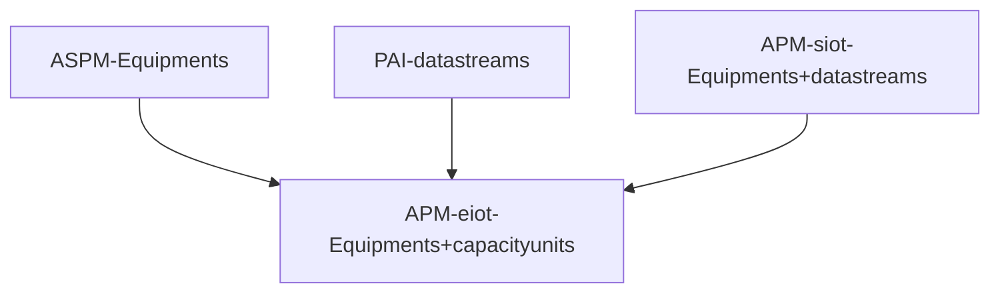

# Introduction

The legacy products SAP IoT, SAP PDMS (Predictive Maintenance and Service), SAP ASPM (Asset Strategy and Performance Management), SAP PAI (Predictive Asset Insights) or SAP APM (Asset Performance Management) based on SAP IoT 
 have been sunset by SAP in 2022, 2023 and 2024 respectively.
New customers cannot buy these products anymore.

The alternative to PDMS, PAI or ASPM and the successor to APM based on SAP IoT is _APM based on Embedded IoT_ (short: _APM eiot_).
APM eiot was made generally available in October 2024.
All customers and partners should migrate to APM eiot in the course of 2025 at the latest.
This requires also to license (or swap to) the new APM eiot license.

This guide intends to show the necessary steps to customers, partners and involved SAP personell how this migration can be done technically and commercially.

# Audience and Contribution

This guide is written and continously updated by the dedicated _APM migration coaches_ team that coach those customers during their migration, that are productive on the legacy products.
But it might also be relevant to customers, that have not yet been fully productive with the legacy products and are looking to switch during the project phase.
Your contribution to this guide via pull requests ir by bringing up issues is very much appreciated by the SAP APM community.

People involved or driving the migration at the customer might be the
 _Reliability Engineer_ that wants to understand the functional differences and the implications to his data and processes,
 the internal (or partner staffed) _IT_ person that wants to understand the necessary technical steps and plan the migration or
 the _Buyer_ that wants to understand how entitlements and costs change with the new product.

A partner engaged by the customer might be an implementation partner,
 a software partner that provides complementary software or a reseller that sells APM.
To simplify refering to either the in-house customer IT or the personell of the implementation partner of choice
 we will in this guide refer to _IT_ simply.
To simplify this guide both the reseller account executive or the SAP account executive are referred to as _Account Executive_.

The SAP personell typically required in the migration of customers is the _Account Executive_ who needs to negotiate the new license terms and conditions with the customer _Buyer_,
 the _Customer Success Partner_ who helps the customer with adopting this and other DSC (Digital Supply Chain) solutions,
 the _Product Team Member_ (e.g. a developer or a product manager) helping to understand specific product capabilities or answering a support ticket.

We will use the above roles marked in _italic_ throughout the guide to allow you to find more easily the aspects related to your role.

# Technical & Commercial Migration Scenarios

The below visualisation provides an overview how to migrate data from existing legacy tenants to a target APM eiot tenant.

PDMS and PAI are based on the same technology. That's why the rest of the guide will only refer to PAI.

As usual its a good idea to migrate a development or test tenant ahead of migrating a production tenant to ensure that there are no surprises in regards of capabilities or usage.
If the tenant migrated is a production tenant used by APM end users, e.g. _Reliability Engineers_ then its migration needs to be carefully planned by _IT_ and needs to consider which data needs to be retained and how the switch over happens.

As you might have multiple deployments of PAI, ASPM and APM siot in parallel you might end up with less tenants compared to what you have today.
This is supported by APM combining the features and data model of ASPM and PAI into one product.
With APM however you have to have a separate tenant for each backend which increases the number of tenants required compared to PAI and ASPM.

APM eiot is onyl offered on Azure. So customers with legacy tenants in AWS have to consider setting up additional subaccounts in Azure (eu20, us20) to deploy APM eiot tenants there.

From a commercial migration point of view the license metrics map to each other as follows.

One key difference is that in APM eiot the Equipments metric is only measured in the production tenant (assuming that the other tenants have the same or less number of equipments in them).
The capacity units (additional usage based metric) are measured across all tenants.

In most cases where customers licensed and used both Asset Strategy and Asset Health the price per equipment remains stable.
Customers coming from standalone usage of ASPM or PAI will have to pay more per equipment as APM allows for Asset Strategy features and Asset Health features both to be used on the same equipments.

The minimum number of equipments that SAP will allow in a contract has been doubled when compared to APM siot to reflect the current base costs SAP has for each APM eiot tenant.

For more details please refer to the product supplements of the new APM eiot license: https://assets.cdn.sap.com/agreements/product-use-and-support-terms/cls/en/sap-asset-performance-management-and-sap-asset-performance-management-advanced-capabilities-add-on-supplement-english-v10-2024a.pdf.

The following sections address different scenarios and the concrete migration approach for each.

## Migration from PAI or ASPM to APM

The migration from PAI and ASPM is supported with tools provided by the _APM Product Team_ that allow _IT_ together with a _APM migration coach_ to export data from the old tenants and import it into the target APM eiot tenant selectively.
The following subset of objects is supported with these tools:

1. Recommendation
2. Risk and Criticality Assessment
3. Risk and Criticality Assessment Template
4. Failure Mode and Effects Analysis
5. Reliability Centered Maintenance
6. Indicators
7. Alerts & Alert Types
8. Time Series

The first 5 tools (ASPM) are based on internal apis and on flows provided in an SAP internal DI (SAP Data Intelligence) instance so only D- or I- users can apply them.
If a partner is engaged in _IT_ he might have a C-user with access to the SAP network which would also allow him to make use of these tools directly.

The last 3 tools (PAI) have been built on public apis and can be used by anyone. They are provided in the same github repository in which this guide is provided.

For all of the remaining object types or configuration the migration has to happen manually (e.g. configuration, FMEA templates, devices ...) which means that in the new tenant they have to be recreated manually.

All objects replicated from _ERP_ (in the rest of the document this might refer to either ECC or S4 Private Cloud Edition or S4 Publich Cloud Edition) can be replicated again from such backend but the configuration for this replication (e.g. which class types ...) has to be done manually following the APM getting started and the APM integration guides for APM eiot at https://help.sap.com/docs/SAP_APM. 

None of these migrations is simple as in all cases a new tenant and an old tenant have to exist in parallel until the usage can be switched over to the new tenant completely.
The underyling data model is based in the case of PAI and ASPM on ACF (Asset Central Foundation) and in the case of APM on ERP (the One Domain Model to be precise) so the terminology and the functional possibilities change significantly.

If PAI has been used please additionally refer to the section [here](#Migrating-IoT) below for additional considerations.

For a full list of functional differences and features, that might be available only at a later date please refer to chapter [here](#Feature-Comparison) below.

From a commercial migration point of view the APM eiot license has to be in place so you can create APM tenants and the ASPM or PAI license should remain in place, while you still productively use them.
So an overlap for the duration of the migration project makes sense.
In most cases the _Account Executive_ will establish a partial swap initially and then do a full swap of all licenses to the new one when the migration is planned to be completed.

## Migration from APM siot to APM eiot

The migration from APM siot to APM eiot will be supported by a planned feature that allows you to copy an APM tenant in full and then swaping this tenant from siot to eiot.
If the copy step is not needed (tenant is already on Azure, scope used requires no post-processing, tenant is not a productive tenant and a shorter or longer downtime is acceptable) then a swap can be requested from SAP once such feature is offered by the _APM product team_.

The copy and the swap will not retain any rules as the rule logic is so fundamentally different between siot and eoit that all rules have to be reestablished manually.
It will also not retain any time series data - this will have to be exported from the old tenant and imported into the swapped tenant.
Lastly everything that is device management specific (e.g. mqtt endpoints, additionally established trust certificates, gateways, firmware coding, payload structure ...) will basically be not available until device management will be offered again in APM eiot and even then it will be fundamentally different and retention is likely not possible.

In regards of migration scope and effort based on the usage scope the migration can range from something that can be done on the weekend to a multi-week project. Here are a few examples:

1. If only Asset Strategy objects are used and the tenants are already on Azure (eu20, us20) and if the APM eiot license is in place then the swap can be done on the weekend with some smoke testing Monday morning and afterwards business users should be able to use the system again based on the new URLs and the (to be updated) end user documentation.
2. If anything in Asset Strategy is used plus data ingestion via api and the indicator chart then its conceivable to also switch over on a weekend albeit bringing in the historic time series data might take some days to be completed.
3. If rules have been created or if device management was used extensively please refer to the section [here](#Migrating-IoT) below.

Additional constraints for the migration can be there if you extended APM via API or via UI.

For a full list of functional differences and features, that might be available only at a later date in APM eiot please refer to chapter [here](#Feature-Comparison) below.

From a commercial point of view the old APM (base) license for APM was based on the material number 8012342.
The new APM (base) license is based on material number 8018912. 

The new APM license is required to create a subscription to APM with plan "production" and hence all customers should license the new APM license ahead of or at the latest during their migration project.

All new APM tenants created after October 2024 will be by default test or development tenants for APM eiot independent of the old or the new license beeing present.
This is to allow development or testing of the new APM to be done as early as possible.
In exceptional cases, where an APM siot tenant is still temporarely required, such tenant can still be provisioned.

_Account Executives_ and _Customer Success Partners_ should refer to the Pricing Guide at https://workzone.one.int.sap/site#workzone-home&/groups/OhWCaHn2WD0dJcCE7NPMEz/workpage_tabs/x7b6HI0YannX29dEGAGK3L (only visible to SAP personell and strategic partners).

## Migrating IoT

The new APM Architecture offers 2 options for integrating with devices.
The decision which one to use will have an impact on the migration as it might require more or less work to migrate, more or less work to operate the device integration and also has an impact on the licenses you need in the future.

The first option is called _Data Integration_ and assumes that you have stored time series data from your devices using technologies from other Vendors (OPC UA data historian, Osisoft PI, Azure IoT, AWS IoT ...) already and you simply want to forward the data from there to APM.
With this approach you have the benefit of leveraging your existing investment and a simple api or file upload interface to feed the data into APM in regular intervals.
Another benefit is that the 25GB (gigaybytes) offered in the base license allow you to load a lot of data into APM - especially when using the file upload that uses the highly efficient parquet file format.
Please take the limitations in regards of how much real-time data you can submit into account - the note at https://me.sap.com/notes/3502042 describes the limitations in detail.

The second option is planned to become available in Q2 2025 (see roadmap for APM at https://roadmaps.sap.com/board?PRODUCT=73555000100800003351&range=CURRENT-LAST#;INNO=F97566F157581EEEAEAAF56AD394D311) is called _Device Integration_ and allows you to make full use of the underlying Cumulocity device management possibilities.
Hence you can onboard devices directly via the Internet and leverage common protocols like mqtt.
Each indicator value can be sent as it happens individually. The base license includes 1 million messages per month and if more are required additional capacity units need to be licensed.

Both options will be available in the future but for the migration the question is which one to choose to migrate based on it.
For most customers this means one of 4 things to do change with the migration:
1. api: Continue to use (or newly implement) api based ingestion taking into acount current limitation of a maximum of 100 000 measurements per day across all equipments.
2. file upload: Implement the new file upload. Its usually facilitated by a custom developed script that is run e.g. every hour to convert the data into the format required by APM and then upload it.
3. mqtt: Wait for the mqtt based ingestion to become available, evtl reonboard all devices and evtl adjust payload to match the mqtt format required by the new APM architecture/cumulocity.
4. A combination of the above options

# Feature Comparison

This comparison only shows differences. All features that are available across all products are not listed (e.g. the ability to create a custom Fiori Launchpad).

| Topic      | PAI | ASPM | APM siot | APM eiot |
|-------     |-----|------|----------|----------|
| Data Model | Asset Central Foundation | ACF | ERP | ERP |
| Multi Backend | Yes | Yes | No | No |
|ECC Version|SAP ERP: ECC 6 EHP7 SP14|SAP ERP: ECC 6 EHP7 SP14|SAP ERP: ECC 6 EHP7 SP14||
|S/4 Version|SAP S/4HANA: 1610 FPS01|SAP S/4HANA: 1610 FPS01|SAP S/4HANA 2020 and higher, SAP S/4HANA Cloud||
|Productive Service Plan|No|No|No|Yes|
|Region|eu10,eu20,us10,us20|eu10,eu20,us10,us20|eu10,eu20,us10,us20|eu20,us20|
|Standalone capable|Yes|Yes|No|No|
|Model Concept|Yes|Yes|No|No|
|Indicator Groups|Yes|Yes|No|?|
|System Concept|Yes|Yes|Planned|Planned|
|Navigation to ERP|||||
|Navigation from ERP|||||
|Checklists|No|Yes|No|No|
|Embedded SAC|Yes|Yes|Yes|Planned|
|Risk Based Inspections|No|Partner|Partner|Partner|
|Anomaly Detection|Yes|n/a|Yes|Planned|
|Custom ML Models|Yes|n/a|Yes|?|
|Streaming Rules|Yes|n/a|Yes|Planned|
|Scheduled Rules|Yes|n/a|Yes|Yes|
|Batch Upload|No|n/a|No|Yes|
|Device Management|Yes|n/a|Yes|Planned|
|View Work Orders|||||
|View Technical Objects|||||
|Create Rules via Recommendations|No|No|Yes|Planned|
|Data Retention||||24 months|
||||||
||||||

The following chapters describe the Topics listed above and how to mitigate if you are affected by the difference when migrating.

## Data Model

The ACF data model was brought forward by Business Network for Assets and is still used there.
The data model used by APM is based directly on the concepts known from EAM in SAP ERP and is relating to the "One Domain Model".

## Multi Backend

With former products hooking up one tenant to multiple ERPs was possible. With APM this is not possible anymore.
If you have multiple ERPs you need to license additional test or production tenants from SAP for each.

## ECC or S/4 Version

For more details see this page: https://help.sap.com/docs/SAP_APM/e260612a886a4e0f8d2e6bed2a648c5d/8b5cdbec76e54b049b3737a95015fcf0.html?locale=en-US.

## Productive Service Plan

It was always possible to flag a subaccount as "productive" or not.
Only with the APM eiot license and the associated entitlement you get access to the plan "productive" which is the one that will be metered continously by SAP.

## Region

Generally SAP could make APM eiot available on other hyperscalers other then Azure down the road but its is not planned in 2025.
If SAP does so it will anounce this in the roadmap ahead of time and it will be equal in scope and capabilities on any region offered.

## Standalone

With the shift from PAI and ASPM to APM standalone is not possible anymore.
An ERP system from SAP with EAM configured and running is always required as the basis for APM.

# Planned Improvements to this Guide

Provide descriptions and mitigations for feature differences between ASPM, PAI and APM siot vs APM eiot.

Mention Plant Connectivity and its future.

Provide example of how many measurements can be sent regularly with the base license alone from devices, via api or via file upload.
