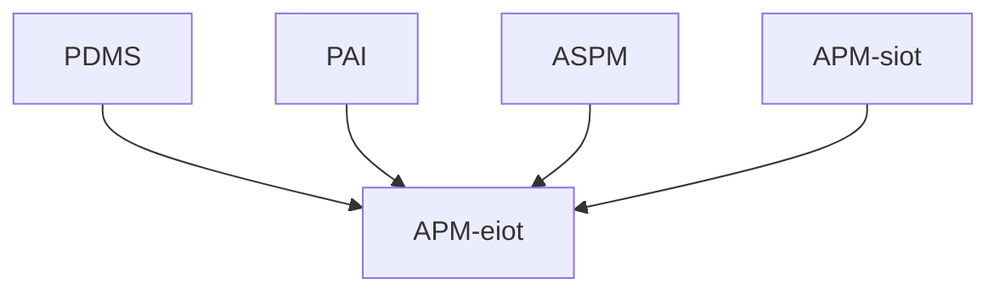

# Introduction
The legacy products SAP PDMS (Predictive Maintenance and Service, SAP ASPM (Asset Strategy and Performance Management),
SAP PAI (Predictive Asset Insights) or
SAP APM based on SAP IoT (Asset Performance Management) have been sunset by SAP in 2022, 2023 and 2024 so that new customers cannot buy these products anymore.

The alternative to PDMS, PAI and ASPM and the successor to APM based on SAP IoT is APM based on Embedded IoT made generally available in October 2024. The old (base) license material number for APM was 8012342 and the new (base) license material number for APM is 801892.

This guide intends to show the way to customers, partners and involved SAP personell how this migration can be done commercially and technically.
# Audience and Contribution

This guide is meant for everyone driving or participating in the migration to APM based on Embedded IoT.

This guide is continously updated by the dedicated _APM migration coache_s that work with customers that are productive on the legacy products to coach them in the migration. But it might also be relevant to customers and partners that have not yet been fully productive with the legacy products or that are implementing the new APM architecture and are knowledgeable about the legacy products.

At the customer this might be the _Reliability Engineer_ that wants to understand the functional differences and the implications to his data,
the internal (or partner) _IT_ person that wants to understand the necessary technical steps and plan the migration or
the _Buyer_ that wants to understand how entitlements and costs change with the new product.

The partner might be an implementation partner chosen by the customer to support the migration,
a software partner that provides complementary software,
a software partner that provides components of APM
or a reseller that sells APM. To simplify refering to either the in-house customer IT or the personell of the implementation partner of choice we will in the guide always refer to _IT_ simply.

The SAP personell is the _Account Executive_ who needs to negotiate the new license terms and conditions with the customer buyer,
the _Customer Success Partner_ who helps the customer with adopting this and other DSC (Digital Supply Chain) solutions,
the _Product Team Member_ (e.g. a developer or a product manager) helping to understand the product or answering a support ticket.

To simplify this guide both the reseller account executive or the SAP account executive are referred to only as _Account Executive_.

We will use the above roles marked in italic consistently throughout the guide to allow you to find more easily the aspects related to your role.
> [!NOTE]
> Your contribution to this guide is very much appreciated by the SAP APM community so please feel free to create issues or to create pull requests if you want to correct or enhance it.
# Migration Scenarios

The migration from PDMS and PAI are really based on the same technology below. The rest of the guide will only refer to PAI.

The migration from PAI and ASPM is supported with tools that allow _IT_ together with a _APM migration coach_ to export data from the old tenants and import it into the target APM eiot tenant selectively. Only the following subset of objects is supported.
# Migration Steps - APM-siot to APM-eiot without usage of Asset Health features
- [x] Customer IT and evtl partner read this guide
- [ ] Customer IT and SAP customer success partner to project future usage
- [ ] Customer Buyer swap license with SAP account executive from 8012342 to 8019182
- [ ] Wait for tenant copy/swap to become available
- [ ] Create a ticket to copy/swap your tenant

