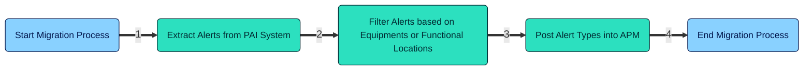
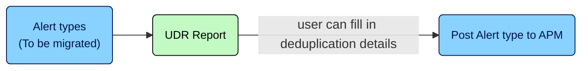
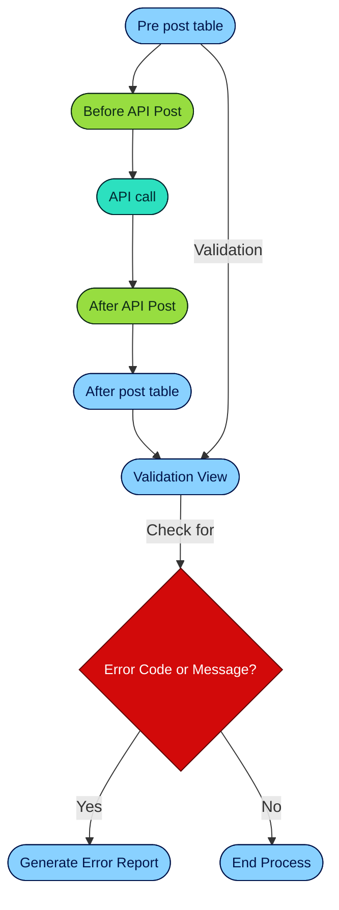

# Alerts

## Table of contents

1. [Overview](#overview)
2. [Limitations and Assumptions](#limitations-and-assumptions)
3. [Pre-requisites](#pre-requisites)
4. [Extraction](#extraction)
5. [Filter PAI Alerts for Valid Technical Objects (TO)](#filter-pai-alerts-for-valid-technical-objects-to)
6. [Fetch and Stage Alert Types](#fetch-and-stage-alert-types)
7. [Deduplication](#deduplication)
8. [Pre and Post data validation](#pre-and-post-data-validation)
9. [Staging the alerts to APM](#staging-the-alerts-to-apm)

This document provides a detailed explanation of the steps and functions used in the `Alerts.ipynb` notebook for extracting, transforming, and loading alerts data.

## Overview

The process flow from PAI to APM involves extracting alerts data from the PAI system, transforming it to the required format, and then loading it into the APM system. This ensures that the alerts are accurately represented and actionable within the APM environment.

## Limitations and Assumptions

### 1. The technical objects (here equipment or functional locations only considered) associated with the alerts are already extracted with indicators linked to it

* The association of external ID to technical object is (1:1) and the technical object has at least one indicator associated with it.

### 2. Deduplication for alert types is a user-given value

* This means that a user decision report (UDR) is provided for the user to fill in the deduplication enablement and the time interval.
* The user input is valid and there is no change in the pre-existing data in the file.

## Pre-requisites

### 1. Set Configuration

* Set a `CONFIG_ID` for execution.
* Load the configuration file (YAML) from the `config` folder based on the `config_id`.

### 2. Create Directories

* Create directories for data extraction and error reports based on the configuration. In the case of Alerts, there are three subdirectories created:
  * Data: To store the data as parquet files
  * Error: To store the error files generated
  * UDR: To store any files that require the user input to process the next steps.

### 3. Database Connection

* The database configurations are mentioned in the config and YAML files. After the connection is established, all the tables and views that are required are created. Then, create necessary tables in the database specified in the configuration if they do not already exist.

### 4. Initialize Logger

* The **Logger class** is used to log the events that are recorded in the log file. Here, we are initializing the logger class and the log file configurations. The log file is created based on the system configuration chosen and the log file is created in the migration-data folder.

## Extraction

The first step is to extract all the available alerts in the PAI system. The API used is as follows:

| API Name   | Reference                                                                                       |
|------------|-------------------------------------------------------------------------------------------------|
| Get Alerts | [Alerts API](https://help.sap.com/doc/67e020f1e7884a17a0b7693bf587c1e6/2105/en-US/Alerts.html#alerts_get) |

After getting all the alerts, we transform the data if required and then stage them into the table created in the database. The table is truncated first if there are any records in it, and then re-entered with the new data.

| Table Name  | Description                                             |
|-------------|---------------------------------------------------------|
| T_PAI_ALERTS | Staging table for alerts extracted from the PAI system. |

## Filter PAI Alerts for Valid Technical Objects (TO)

The next stage is to filter out the alerts based on the technical objects (here equipment and functional locations are considered) on the below conditions:

* TO has an external ID associated with it.
* TO has a template and in turn indicator(s) associated with it.

The resulting IDs that have both the above are considered in a view created. This view will be used to filter out the relevant Alerts that need to be migrated.

| View Name            | Description                                              |
|----------------------|----------------------------------------------------------|
| V_TRANSFORM_INDICATORS | View for fetching valid technical objects based on specific conditions. |

## Fetch and Stage Alert Types

In order to migrate the Alerts, the corresponding Alert types need to be present in the target APM system. To ensure this, we first get the list of Alert types that are there in the filtered list of alerts.

We check the alert types to be migrated by fetching the available alert types in the APM system. Once we have identified the alert types to be migrated, the data is transformed to be pushed to the target system.

## Deduplication

For alert types, the 'Deduplication' functionality is used when several alerts from the technical object should be considered. Within a specified time frame, these multiple identical alerts would be considered as a single alert. In order to enable this, an indicator for deduplication (DeduplicationIsEnabled) is set to true and the deduplication period is mentioned.

The deduplication period can be set for minutes, hours, or days. For example, for 30 days, we specify 30D.

If the deduplication indicator is set to false, then each alert instance will be considered independently.

With the current API, we are unable to capture this information. For this, the User Decision Report (UDR) is created with empty columns for DeduplicationPeriod and DeduplicationIsEnabled columns, for the user to provide their input. Once this is entered, it can be provided to the API and all the alerts migrated with this alert type can have multiple instances in the said time interval. If no values are provided, the alert types can be migrated with alerts created independently.

## Pre and Post data validation

If any issues arise when posting the data, be it alert types or alerts, we need to make sure that they are captured in a file for checking the issues. So before and after we post the data, we store it in a table. If any issues arise when posting the data, we capture those as the error code and the corresponding error message.

A view is created which keeps a check on the valid records, based on the occurrence of error code/message. This view is utilized to generate an error report.

For Alert types, below are the tables and view used and the API:

| Table Name       | Description                                             |
|------------------|---------------------------------------------------------|
| T_ALERTTYPES     | Staging table for alert types to be migrated to the APM system. |
| T_POST_ALERTTYPES | Table having migrated (or errored out) alert types.     |

### View for Validation of Alerts

| View Name         | Description                                      |
|-------------------|--------------------------------------------------|
| V_ALERTTYPE_CHECK | View for fetching the errored out alert types    |

### API for Alert Types

| API              | Description                     | Reference                                                                 |
|------------------|---------------------------------|---------------------------------------------------------------------------|
| Post Alert types | Posting Alert types to APM      | [Post Alert Type API](https://api.sap.com/api/AlertType_APIs/path/post_AlertType) |

## Staging the alerts to APM

Once the alert types are migrated, we proceed to migrate the alerts. The respective alerts for the alert types migrated are filtered and transformed. The post data will have three columns:

* AlertType
* TriggeredOn: What time it was triggered at
* Technical objects: It contains the technical object number, the SSID of the system, and the type of technical object. This is sent as a list (if there are multiple TOs, which is again dependent on the deduplication factor mentioned in the alert type).

Below are the tables, view, and API used for migrating alerts:

| Table Name     | Description                                             |
|----------------|---------------------------------------------------------|
| T_ALERTS       | Staging table for alerts to be migrated to the APM system. |
| T_POST_ALERTS  | Table having migrated (or errored out) alerts.          |

### View for Validation

| View Name      | Description                                      |
|----------------|--------------------------------------------------|
| V_ALERTS_CHECK | View that contains the invalid records for generating error report |

### API for Alerts

| API         | Reference                                                                 |
|-------------|---------------------------------------------------------------------------|
| Post Alerts | [Post Alert API](https://api.sap.com/api/Alert_APIs/path/post_Alert)      |

The same validations are applied for checking if there are any errors encountered while posting the data to APM.

## Extracting Alerts from APM (WIP)

This part is WIP. This section includes the code for posting Alerts from APM SIOT to APM EIOT.
