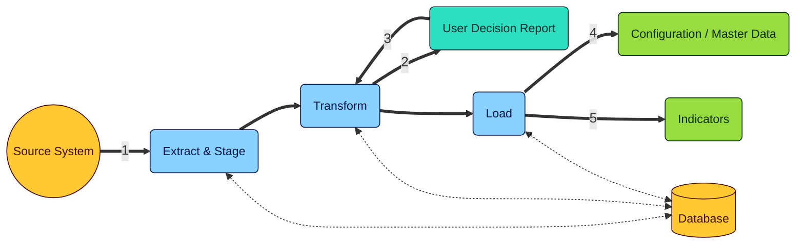
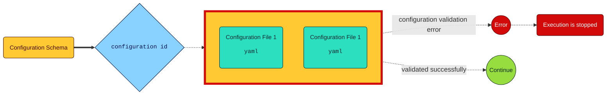
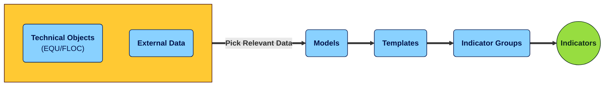
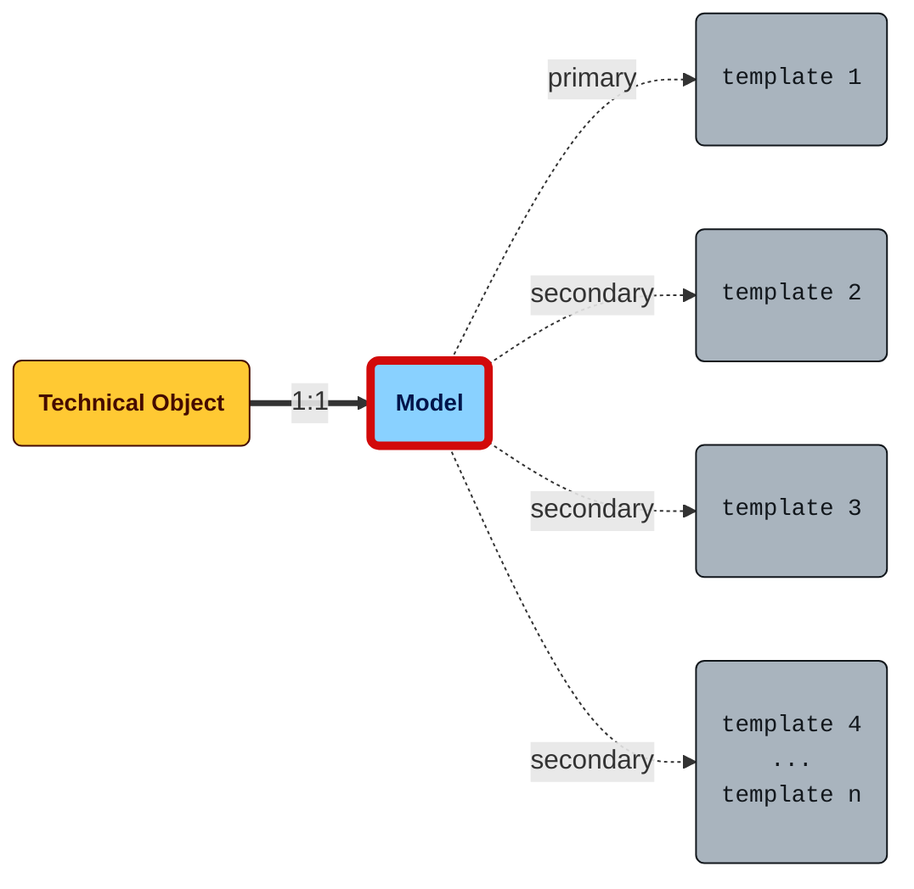
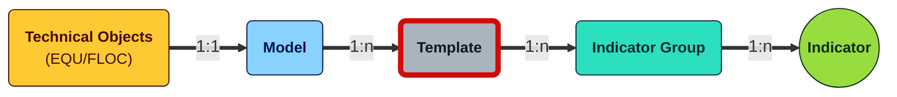
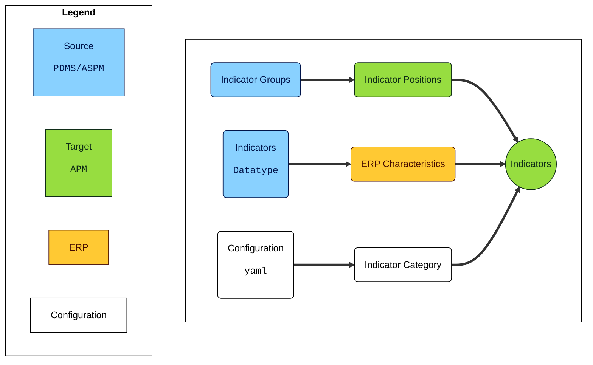

# Indicator Migration

## Table of Contents

- [Indicator Migration](#indicator-migration)
  - [Table of Contents](#table-of-contents)
  - [1. Overview](#1-overview)
  - [2. Limitations \& Assumptions](#2-limitations--assumptions)
    - [External IDs for Technical Objects](#external-ids-for-technical-objects)
    - [Characteristics Data Type](#characteristics-data-type)
    - [ERP Characteristics Sync](#erp-characteristics-sync)
    - [UDR Input Validation](#udr-input-validation)
      - [Indicator Positions](#indicator-positions)
  - [3. Pre-requisites](#3-pre-requisites)
    - [Configuration](#configuration)
    - [Database](#database)
  - [4. Data Extraction](#4-data-extraction)
    - [Technical Objects](#technical-objects)
    - [External Data](#external-data)
    - [Models](#models)
    - [Templates](#templates)
      - [Indicator Groups](#indicator-groups)
      - [Indicators](#indicators)
  - [5. Transformation](#5-transformation)
    - [Generation of UDR](#generation-of-udr)
    - [UDR Load](#udr-load)
  - [6. Data Load](#6-data-load)
    - [ERP Characteristics](#erp-characteristics)
    - [APM Indicator Positions](#apm-indicator-positions)
    - [APM Indicators](#apm-indicators)

## 1. Overview

- This section describes about the **Indicator Migration** tool, the APIs & processes involved in migrating indicators
from an ASPM (or) PAI system to APM (sIOT) or APM (eIOT).
- Data is extracted from the source system, transformed and then loaded into APM.
- The extraction of data from the source, uses APIs from the Business Network Asset Collaboration (or) Asset Central Foundation (ACF) to connect to the source system.



- **Step 1:** Extract & Stage the data from the source system (PAI) or ASPM.
- **Step 2:** A User Decision Report (UDR) is generated based on the extracted data which contains certain *proposals* by the tools
- **Step 3:** User reviews the proposals (and accepts) or has the provision to input values. This data from the UDR is considered for transformation.
- **Step 4:** Based on the UDR, necessary configuration or master data is created in the specific systems
- **Step 5:** Once configuration/master data is loaded, indicators are loaded into APM.

## 2. Limitations & Assumptions

### External IDs for Technical Objects

- There is a possibility that one technical object (equipment or functional location) maybe assigned with multiple external IDs in the source system
- This is currently not supported for migration.
- **Assumption:** During migration we assume that there will be only one External ID assigned to a technical object (1:1). If there are multiple, we pick a random external ID for the migration.

### Characteristics Data Type

- APM supports characteristics of datatype: `numeric` and `date`.
- If there are other characteristics with other datatype(s), they are not loaded to APM.

### ERP Characteristics Sync

- The migration tool creates characteristics in the ERP system if there are not present in the ERP system already.
- When a new characteristic is created in ERP, it syncs with APM only after `120 minutes` (or)
requires to be manually synced by the user.
- The sync between ERP & APM has to happen for the migration tool to work as expected.
  - Either we wait manually for the sync to happen before loading the Indicators to APM (or)
  - Perform a manual sync in the APM system

### UDR Input Validation

- During the `transform` part, a user decision report is generated with a few proposal values.
- User can override the proposed value with custom input
- Data validation is **NOT** performed on the values that are input by the user and these values will
be considered as final while loading into the APM system.
- If there are any issues in the user input, the tool will still try to load the data into APM.

#### Indicator Positions

- Indicator Groups (from source) are proposed as Indicator Positions in APM.
- Since special characters are not supported for Indicator Positions, they are stripped out if present in the Indicator Group from the source
- There is a limitation of 20 characters for indicator positions in APM, hence if there are any more characters in Indicator Group, they are truncated.

## 3. Pre-requisites

The following pre-requisites are necessary to be performed before migrating the indicators.

### Configuration

- All necessary configurations required for the tool are maintained as `yaml` files based on a `schema`.
- These files are stored in the `config` directory.
- Each `yaml` file contains a unique `config-id` parameter.
- A `sample-config.yaml` is provided in the same directory for creation of new yaml configuration files.
- First cell of the Jupyter Notebook defines the `CONFIG_ID` which needs to be provided by the user for execution.



### Database

- Based on the connection string maintained in the yaml configuration file, the database needs
to be created/accessible by the Jupyter notebooks.
- If there are any credentials required to access the database,
the corresponding user needs to have access to DDL (`CREATE`, `DROP`) and
DML (`INSERT`, `SELECT`, `TRUNCATE`, `MODIFY`) statements with all read/write authorizations.

## 4. Data Extraction



- Extraction data is staged in the directory maintained in the configuration file.
- A subfolder `REPORTS` is created within the directory which stores error reports if generated during the migration.

### Technical Objects

This section involves extracting technical objects, specifically Equipments and Functional Locations, from the source system. The extraction process applies the following filters:

- `templateId` is not blank.
- `status` is not 1 (ignores records with unpublished status) - this means that the TOs with statuses, `published` and `in revision` are considered for migration

The extracted data is saved as parquet files and staged in the corresponding tables in the database:

| Table Name        | Description                |
| ----------------- | -------------------------- |
| T_PAI_EQU_HEADER  | Equipment Header           |
| T_PAI_FLOC_HEADER | Functional Location Header |

| API                 | Reference                                                   | Parameters |
| ------------------- | ----------------------------------------------------------- | ---------- |
| Equipment           | <https://api.sap.com/api/EquipmentAPI/path/get_equipment>     | `filter`   |
| Functional Location | <https://api.sap.com/api/FunctionalLocationAPI/path/get_floc> | `filter`   |

### External Data

This section involves extracting external IDs for Equipments and Functional Locations from the source system. The extraction process applies the following filters:

- `systemType` is 'ERP'.
- `systemName` is `<sap-system-id>_<sap-client-number>`.
- `externalId` does not contain 'LOCAL_'.
- `objectType` is 'EQU' or 'FLOC'.

The extracted data is saved as parquet files and staged in the corresponding tables in the database:

| Table Name              | Description                          |
| ----------------------- | ------------------------------------ |
| T_PAI_EXTERNALDATA      | External Data (Equipments)           |
| T_PAI_EXTERNALDATA_FLOC | External Data (Functional Locations) |

| API           | Reference                                                    | Parameters |
| ------------- | ------------------------------------------------------------ | ---------- |
| External Data | <https://api.sap.com/api/ExternalIDsAPI/path/get_externaldata> | `filter`   |

### Models

This section involves extracting the model related information linked to the technical object. The process uses the ApiModel to fetch detailed data for unique models assigned to the technical objects (equipments or functional locations).



### Templates

This section involves extracting templates related to the technical objects. The extraction process uses the `ApiTemplate` to fetch detailed data for each template based on the `templateId` extracted for the Technical Objects (Equipments or Functional Locations) from above.



- When template information is extracted using the `templateId`, relevant indicator groups and indicators assigned to the templates are also extracted.

The templates from the relevant technical objects are extracted and passed to the APIs. Following are the tables/views used for the same.

| Table Name                  | Description                                                       |
| --------------------------- | ----------------------------------------------------------------- |
| V_PAI_EQU_EXTERNAL_DATA     | **[VIEW]** Relevant Equipments with External Data                 |
| T_PAI_EQU_TEMPLATE_HEADER   | Template Header (Equipments)                                      |
| T_PAI_EQU_INDICATOR_GROUPS  | Indicator Groups extracted from templates (Equipments)            |
| T_PAI_EQU_INDICATORS        | Indicators extracted from Indicator Groups (Equipments)           |
| V_PAI_FLOC_EXTERNAL_DATA    | **[VIEW]** Relevant Functional Locations with External Data       |
| T_PAI_FLOC_TEMPLATE_HEADER  | Template Header (Functional Locations)                            |
| T_PAI_FLOC_INDICATOR_GROUPS | Indicator Groups extracted from templates (Functional Locations)  |
| T_PAI_FLOC_INDICATORS       | Indicators extracted from Indicator Groups (Functional Locations) |

| API           | Reference                                                           | Parameters |
| ------------- | ------------------------------------------------------------------- | ---------- |
| External Data | <https://api.sap.com/api/TemplateAPI/path/get_templates__templateID_> | `filter`   |

#### Indicator Groups

The extracted indicator groups are saved as parquet files and staged in the corresponding tables (mentioned above) in the database.

#### Indicators

The extracted indicators are saved as parquet files and staged in the corresponding tables (mentioned above) in the database.

## 5. Transformation

This section involves transforming the extracted data to generate a User Decision Report (UDR).

### Generation of UDR

The UDR contains necessary fields from the source system and proposes fields that need user confirmation before migrating the data to the target APM system. The proposals in the UDR are as follows.



- Indicator Groups (from source) mapped to Indicator Positions (in APM).
- Indicators (datatype, length & precision from source) to Characteristics in ERP.
- A static value configured in the configuration as Indicator Category for APM.

The UDR is generated based on the following views created in the database.

| View Name                   | Description                                                    |
| --------------------------- | -------------------------------------------------------------- |
| V_TRANSFORM_EQU_INDICATORS  | Transforms and consolidates data for `EQU` technical objects.  |
| V_TRANSFORM_FLOC_INDICATORS | Transforms and consolidates data for `FLOC` technical objects. |
| V_TRANSFORM_INDICATORS      | Consolidates (union) of EQU and FLOC indicators.               |

The UDR is saved as a CSV file and sent to the user for validation and input.

### UDR Load

- The UDR once filled by the user is then imported into the tool.
- User can provide alternative proposals in the `input` columns.
- A user input takes **higher** precedence - meaning, if there is a input provided by the user, the input will be considered for migration. If there is no input provided, only then the proposal is considered for migration.
- This data is loaded into a table which will act as a basis for data load.

| Table Name           | Description                                  |
| -------------------- | -------------------------------------------- |
| T_UDR_APM_INDICATORS | Stores the UDR data from user for Indicators |

## 6. Data Load

### ERP Characteristics

This section involves loading ERP characteristics into the target system. The process includes:

- Fetching internal IDs for ERP characteristics from the ERP system using the API.
- Creating missing characteristics in the ERP system if they do not exist.

| API                                                                   | Reference                                                                                    | Parameters |
| --------------------------------------------------------------------- | -------------------------------------------------------------------------------------------- | ---------- |
| Characteristic Data for Classification (S/4HANA Cloud Public Edition) | <https://api.sap.com/api/API_CLFN_CHARACTERISTIC_SRV/path/post_A_ClfnCharacteristicForKeyDate> | n/a        |

**`POST` Body**

``` json
{
  "Characteristic": <string>,
  "CharcStatus": "1",
  "CharcDataType": <string>,
  "CharcLength": <int>>,
  "CharcDecimals": <int>,
  "NegativeValueIsAllowed": <bool>,
  "to_CharacteristicDesc": {
    "results": [
      {
        "Language": "EN",
        "CharcDescription": <string>
      }
    ]
  }
}
```

The loaded characteristics are saved as parquet files and staged in the corresponding tables in the database.

### APM Indicator Positions

This section involves loading APM indicator positions into the target system. The process includes:

- Fetching existing indicator positions from the APM system.
- Creating missing indicator positions in the APM system if they do not exist.

| API                                        | Reference                                                                   | Parameters |
| ------------------------------------------ | --------------------------------------------------------------------------- | ---------- |
| Manage Indicators - SAP APM - Asset Health | <https://api.sap.com/api/Indicator_Related_APIs/path/post_IndicatorPositions> | n/a        |

**`POST` Body**

``` json
{
  "SSID": <system_id>,
  "name":<string>
}
```

The loaded indicator positions are saved as parquet files and staged in the corresponding tables in the database.

### APM Indicators

This section involves loading APM indicators into the target system. The process includes:

- Fetching existing indicators from the APM system.
- Creating missing indicators in the APM system if they do not exist.

| API                                        | Reference                                                           | Parameters |
| ------------------------------------------ | ------------------------------------------------------------------- | ---------- |
| Manage Indicators - SAP APM - Asset Health | <https://api.sap.com/api/Indicator_Related_APIs/path/post_Indicators> | n/a        |

**`POST` Body**

``` json
{
  "technicalObject_number": <external_id>,
  "technicalObject_SSID": <system_id>,
  "technicalObject_type": <"EQUI" (or) "FLOC">,
  "category_SSID": <system_id>,
  "category_name": <indicator_category>,
  "characteristics_SSID": <system_id>,
  "characteristics_characteristicsInternalId": <erp_characteristics_id>,
  "positionDetails_ID": <apm_indicator_position_id>
}
```

The loaded indicators are saved as parquet files and staged in the corresponding tables in the database.
