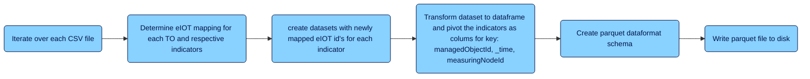

# Time Series Migration

This documentation should give an overview about the migration steps which needs
to be executed for migrating the time series data associated to the technicial
objects in SAP PAI.

## Table of contents

- [Overview](#overview)
- [Pre-requisites](#pre-requisites)
- [Limitations](#limitations)
- [Extract Data](#extract-data)
  - [Overview](#overview-1)
  - [Get Indicator Groups](#get-indicator-groups)
  - [Initiate download](#initiate-download)
  - [Wait until all downloads are ready](#wait-until-all-downloads-are-ready)
    - [Download Time-Series Data to Disk](#download-time-series-data-to-disk)
- [Transform Data](#transform-data)
  - [Overview](#overview-2)
  - [Iterate over each CSV file](#iterate-over-each-csv-file)
  - [Determine eIOT mapping for each TO and respective indicators](#determine-eiot-mapping-for-each-to-and-respective-indicators)
  - [Create datasets with newly mapped eIOT id's for each indicator](#create-datasets-with-newly-mapped-eiot-ids-for-each-indicator)
  - [Transform dataset to dataframe and pivot the indicators as columns for key: managedObjectId, _time, measuringNodeId](#transform-dataset-to-dataframe-and-pivot-the-indicators-as-columns-for-key-managedobjectid-time-measuringnodeid)
  - [Create parquet dataformat schema](#create-parquet-dataformat-schema)
  - [Write parquet file to disk](#write-parquet-file-to-disk)
- [Load Data](#load-data)
  - [Overview](#overview-3)
  - [Combine parquet files](#combine-parquet-files)
  - [Upload files to eIOT](#upload-files-to-eiot)
  - [Check file upload status](#check-file-upload-status)
- [Trouble Shooting](#trouble-shooting)
- [List of Endpoints](#list-of-endpoints)
  - [Extraction](#extraction)
  - [Transform](#transform)
  - [Load](#load)
- [Database Tables used](#database-tables-used)

## Overview

The migration for the time series data is done in 3 steps. First step is to extract the data from the SAP IOT persistance.
Once the data was downloaded to the local machine, we'll transform the data to match the new format for [Time Series Ingestion
by File](https://help.sap.com/docs/SAP_APM/ae1b757328bc465fa5674a1e73e7bf14/40bfd40bdc5d4d5a80377b91f0e745ef.html?locale=en-US).
The result of this transformation are `parquet` files which serve as the input for the last step: load. The load part will
upload all parquet files to the File Upload endpoint and check for processing status.

## Pre-requisites

**Important:** Please read the whole documentation once to understand the whole flow and all involved components before
starting to use it. In addition, the sample programming requires a lot of configurations done. Therefore make sure to setup
all needed parameters in the configuration file(s):

- Database: configure the type of database you want to use (e.g. SqLite, Postgres, HANA)
- Systems: for time-series we expect that you have configured the systems with type: APM, PAI, ACF and IOT
- Extract: maintain all properties under the "time-series" element
- Transform / Load: maintain the directory where to store the data files

**Indicators:** The indicator ETL part needs to be done in advance as this notebook requires a mapping from PAI indicators
to APM indicators which will be created in the steps when migrating the indicators. As a result
the view _V_POST_LOAD_INDICATORS_ will hold all needed information. _If the technical objects already created in the target
APM system without using the indicator ETL scripts you can probaly manually add the lines to the database tables._

## Limitations

The new eIOT persistance is currently supporting numeric indicators and date indicators (**date-only**). Therefore indicators
with datatype **string** or **datetime** or **timestamp** can't be migrated into a corresponding indicator in APM eIOT.

## Extract Data
<!-- markdownlint-disable MD024 -->
### Overview

### Get Indicator Groups

From the tables `T_PAI_EQU_INDICATOR_GROUPS` and `T_PAI_FLOC_INDICATOR_GROUPS` we reuse the already
extracted indicator groups when the data model is based on abstract model. If the time series data
is stored related to the thing model, we need to determine the property set types instead. This is done
using the IOT and model based API's.

### Initiate download

For the extracted indicator groups we'll trigger the download. First we start with yearly time slices.
The overall time-frame and the time slices must be defined in the config file under `[extract]-[time-series]`.
Here you find the properties: `time_range_from`, `time_range_to`, `time_range_interval`.

For each request we'll get a request id back which we save in an internal status table (iot_export_status).

### Wait until all downloads are ready

Next we need to check the processing status of all initiated downloads. Once all
downloads are ready to download we can continue with next step.

The following are the possible statuses:

- Initiated: The request is placed successfully.
- Submitted: The request for data export is initiated and the method is retrieving the data and preparing for the export process.
- Failed: The request for data export failed due to various reasons. The reasons are listed in the response payload.
- Exception: The system retried to initiate the data export but failed.
- Ready for Download: The request for data export succeeded and the data is available in a file format for download.
- Expired: The data that is ready for download is available only for seven days, beyond which the exported data is not available for download. You should re-initiate the request for data export.

### Download Time-Series Data to Disk

The next step is to download the coldstore data to the disk for further processing.
The folder where you want to save the time series data can be defined in the config
section at `["extract"]["time-series"]["directory"]`. As the file size can be large
the download will be done in chunks.

## Transform Data
<!-- markdownlint-disable MD024 -->
### Overview

### Iterate over each CSV file

We'll iterate over all csv files in the download folder and process each file after another.
We expect that each file has a unique property set type or indicator group as this was the
key when downloading the file.

### Determine eIOT mapping for each TO and respective indicators

Next we need to determine the APM and eIOT ID's for each Thing / Indicator from PAI. To avoid
unneccesary API calls we also store the mapping in an own database table for later lookup. So, if the
mapping was already determined before, we can return the values from the DB. Otherwise we need
to do the following steps:

- determine the modelId and modelType from PAI
- from external id api we can now determine the technical object number for the source S4 system
- after finally having the SSID, Number and Type of the technical object we can get the
metadata for this TO from the eIOT Metadata API. This will return the needed information as
managedObjectId and all the measuringNodeId's for the assigned indicators.
- also important to check that the status of the metadata sync is done ("synced")
- to map the "old" PAI indicator to the new indicator in APM we use the own database view
V_POST_LOAD_INDICATORS which holds the information about the newly created indicators in APM.
- if the PAI indicator was created in APM we save this indicator data from eIOT in our internal
mapping table.

### create datasets with newly mapped eIOT id's for each indicator

After the mapping for the technical objects and indicators are derived, we are creating a dataset
for each measurement with the assigned _time, managedObjectId, measuringNodeId, characteristic and
value.

### Transform dataset to dataframe and pivot the indicators as colums for key: managedObjectId, _time, measuringNodeId

As this dataset is loaded into a dataframe, we can easily pivot the data to have all
characteristics in one line, based on the key fields: `_time`, `managedObjectId`, `measuringNodeId`.

### Create parquet dataformat schema

The schema of the dataset will be set afterwards. All indicators with numeric or numeric flexible
get the datatype `float` and a date indicator get the datatype of `date`. Indicators with
string can't be migrated.

### Write parquet file to disk

Finally the dataframe will be written as a parquet file to the location you have configured in the
config file under `["transform"]["time-series"]["directory"]`.

## Load Data

### Overview

### Combine parquet files

First we'll read and combine all files within the same folder of the same indicator group.
The new dataset will be stored in a subfolder named as `ready` within your folder where
the transformed time-series files are stored.
Within this combining we will also make sure that each file for the same indicator group
has not more than 1.000.000 rows as this is a limitation by file upload api from eIOT.

### Upload files to eIOT

The next step is to upload the data to eIOT. As the API has some limitations, we need also to
check that the file size of each file does not reach the limit of **50 MB**. Therefore it might be
that we split the files even further (besides the 1 million lines limit).

Afterwards the files can be uploaded to eIOT file interface. As a result we'll get a file id
back which can be used to check the processing status of the file. We're storing the fild id
therefore in the database table _T_EIOT_UPLOAD_STATUS_.

### check file upload status

The step starts by loading all outstanding file uploads from the internal database. This means all process
which are not finished and not failed. Next we check for each entry the current status of processing
and update also the databse status if it has changed.

After each iteration we'll wait for some time before checking the status again.

This step is stopped by the user or when all uploads are done or failed.

## Troube Shooting

Please refer to the general guide for [troubeshooting](troubleshooting.md)

## List of Endpoints

### Extraction

- Retrieves all thing types from the SAP IoT API.
`https://config-thing-sap.cfapps.eu10.hana.ondemand.com/ThingConfiguration/v1/ThingTypes`
- Get Equipment Models
`https://{{host}}.hana.ondemand.com/ain/services/api/v1/models?$filter=modelType eq 'EQU'`
- Get Functional Location Models
`https://{{host}}.hana.ondemand.com/ain/services/api/v1/models?$filter=modelType eq 'FLOC'`

- get property set by thing type
`https://config-thing-sap.cfapps.eu10.hana.ondemand.com/ThingConfiguration/v1/ThingTypes('{thing_type}')?$expand=PropertySets`

- Initiates the export of time series data for a specified property set type within a given date range.
`https://coldstore-export-sap.cfapps.eu10.hana.ondemand.com/v1/InitiateDataExport/{indicator_group}?timerange={start_date}-{end_date}`

- Retrieves the status of a time series data export request.
`https://coldstore-export-sap.cfapps.eu10.hana.ondemand.com/v1/DataExportStatus?requestId={request_id}`

- Downloads a time series export file sequentially from the IoT endpoint.
`https://coldstore-downloader-sap.cfapps.eu10.hana.ondemand.com/v1/DownloadData('{request_id}'`

### Transform

- Get the SSID of any technical object
`{{host}}/EIoTMetadataSyncService/v1/TechnicalObjects?$top=1&$select=SSID`

- Get external id
`{{host}}/ain/services/api/v1/externaldata?$filter=objectType eq '{model_data["modelType"]}' and systemType eq 'SAP ERP' and ainObjectId eq '{acf_id}'`

- Get ACF Object by Thing Id
`{{host}}/ain/services/api/v1/objectsid/ainobjects({external_id})?$filter=systemName eq 'pdmsSysThing'`

- Get ACF Model Id by External ID
`{{host}}/ain/services/api/v1//objectsid/ainobjects({thing_type})?$filter=systemName eq 'pdmsSysPackage'`

- Get the status of the EIoT Metadata Sync
`{{host}}/EIoTMetadataSyncService/v1/TechnicalObjects(number='10009340',SSID='QM7_910',type='EQUI')?$expand=indicators`

### Load

- Upload a file to the API
`https://api-apm-acceptance.test.apimanagement.eu20.hana.ondemand.com/FileUploadService/v1/upload`

- Get eIOT File Status
`https://api-apm-acceptance.test.apimanagement.eu20.hana.ondemand.com/FileUploadService/v1/files/status('3c279157-76d4-4bfc-87f7-a1630db6b08b>')`

## Database Tables used

- T_PAI_EQU_INDICATOR_GROUPS
- T_PAI_FLOC_INDICATOR_GROUPS
- iot_export_status_table
- T_EIOT_MAPPING
- T_EIOT_MAPPING_INDICATORS
- T_EIOT_UPLOAD_STATUS
- V_POST_LOAD_INDICATORS
